# tesloshop-app

Este proyecto consiste en la contenerización de una aplicación web completa utilizando Docker y Docker Compose.
La aplicación está compuesta por tres servicios principales:

Frontend: Angular + Nginx
Backend: NestJS (API REST)
Base de Datos: PostgreSQL

El objetivo del proyecto es desplegar una arquitectura multicontenedor que permita ejecutar todos los servicios de manera integrada utilizando Docker.

Este laboratorio busca aplicar conceptos de:

Construcción de imágenes Docker
Contenedores
Orquestación de servicios con Docker Compose
Redes Docker
Volúmenes para persistencia de datos

## Arquitectura del Sistema

La aplicación está compuesta por tres contenedores que se comunican a través de una red interna de Docker.

Usuario (Navegador)
        │
        ▼
Frontend (Angular + Nginx)
        │
        ▼
Backend (NestJS API)
        │
        ▼
Base de Datos (PostgreSQL)

 Flujo de funcionamiento
El usuario accede al Frontend desde el navegador.
El frontend realiza peticiones HTTP a la API del backend.
El backend procesa las solicitudes y consulta la base de datos PostgreSQL.
Los datos regresan al frontend para mostrarse al usuario.

Estructura del Proyecto inicial
tesloshop-app/
│
├── docker-compose.yml
├── .env
│
├── teslo-shop/              # Backend NestJS
│   └── Dockerfile
│
├── angular-tesloshop/       # Frontend Angular
│   ├── Dockerfile
│   └── nginx.conf
Dockerfile del Backend

El backend utiliza NestJS y se construye mediante un Dockerfile multi-stage.

Etapas principales

dev

Permite ejecutar el backend en modo desarrollo con recarga automática.

FROM node:19-alpine3.15 as dev
WORKDIR /app
COPY package.json ./
RUN yarn install
COPY . .
CMD ["yarn","start:dev"]

builder

Compila el proyecto TypeScript a JavaScript.

RUN yarn build

prod

Construye una imagen optimizada solo con dependencias de producción.

Beneficios del multi-stage:

Reduce el tamaño de la imagen
Mejora la seguridad
Optimiza el proceso de despliegue
Dockerfile del Frontend

El frontend utiliza Angular y Nginx para servir los archivos estáticos.

Etapas

Build

Compila la aplicación Angular.

npm run build

Runtime

Nginx sirve los archivos compilados desde:

/usr/share/nginx/html

Esto permite tener una imagen ligera sin necesidad de NodeJS en producción.

Docker Compose

El archivo docker-compose.yml permite orquestar los tres servicios de la aplicación.

Servicios definidos:

Base de Datos
db:
 image: postgres:14.3

Se encarga de almacenar los datos de la aplicación.

Incluye un volumen para persistencia:

postgres-data:/var/lib/postgresql/data
Backend

Construye la imagen desde:

./teslo-shop

Expone el puerto:

3000

Se conecta con PostgreSQL mediante variables de entorno.

Frontend

Construye la imagen desde:

./angular-tesloshop

Expone el puerto:

80

Nginx se encarga de servir la aplicación Angular y redirigir las peticiones /api al backend.

Redes Docker

Los tres servicios se conectan mediante una red interna:

teslo-network

Esto permite que los contenedores se comuniquen utilizando sus nombres de servicio.

Ejemplo:

DB_HOST=db
Volúmenes Docker

Se utiliza un volumen para garantizar la persistencia de datos en PostgreSQL.

postgres-data

Esto evita perder la información cuando los contenedores se detienen o eliminan.

## Ejecución del Proyecto

# Estructura del Proyecto finalizado 
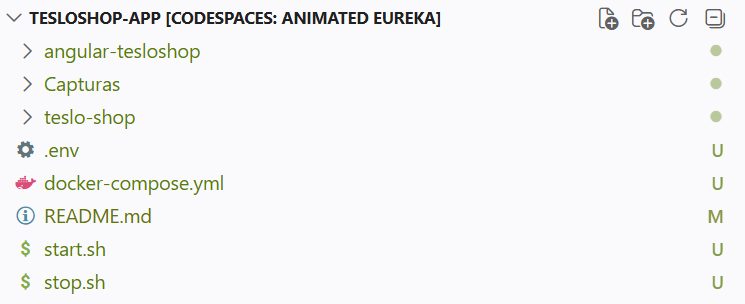

# 1 Hice un fork en el repositorio original
https://github.com/DEV-SENA-TRAINING/tesloshop-app.git y active el codespace

# 2 Dockerfile del backend (NestJS)
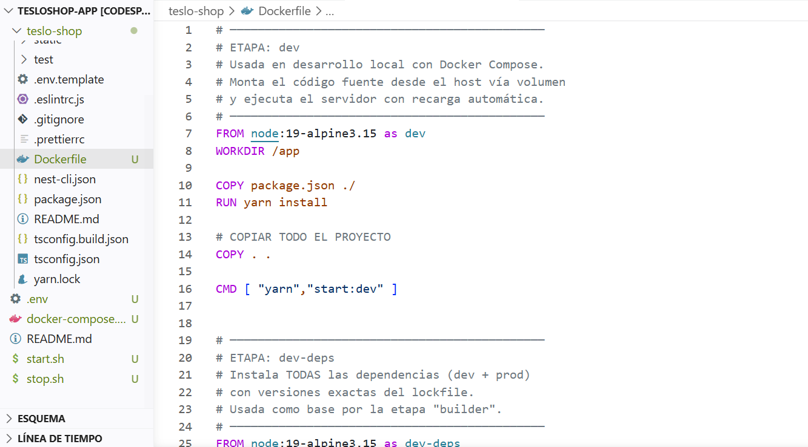

# 3 Dockerfile del frontend (Angular + Nginx)
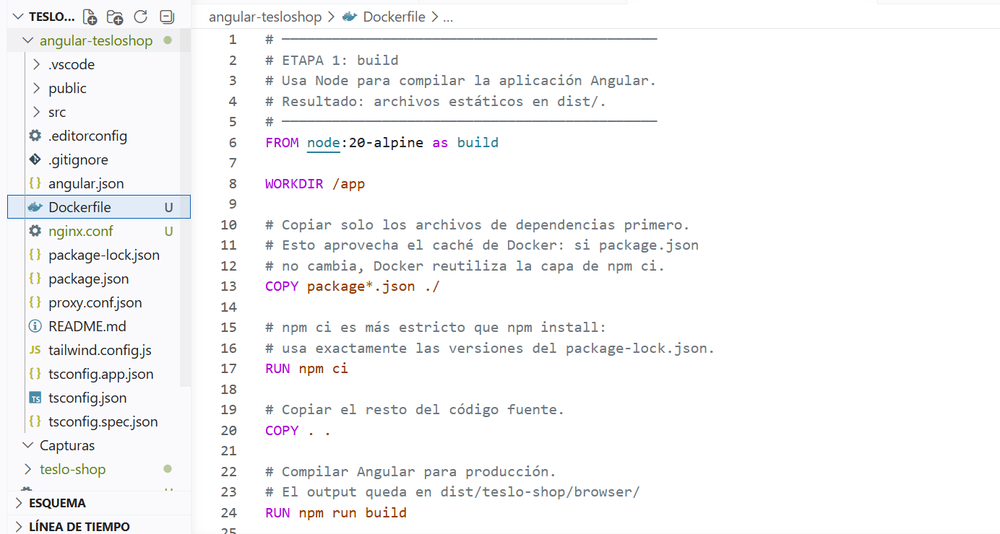

# 4 Configuración de Nginx
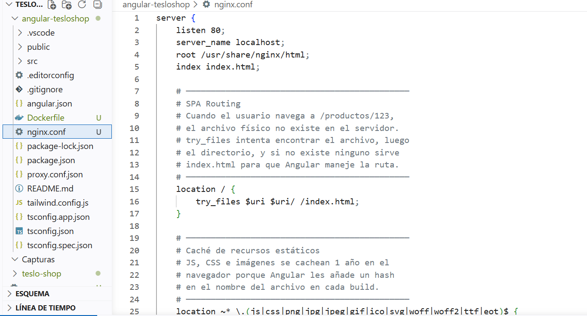

# 5 Variables de entorno (.env)
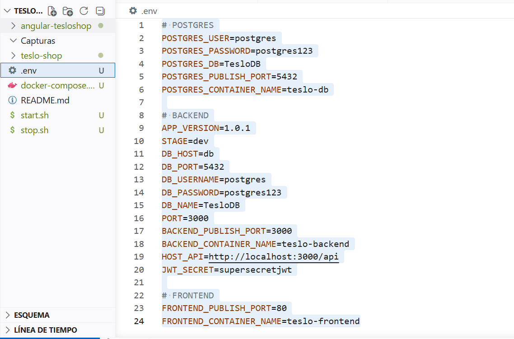

# 6 docker-compose.yml
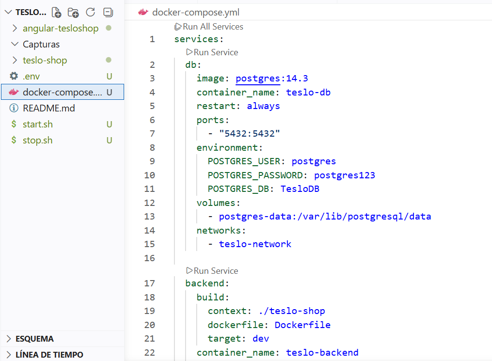

# 7 Scripts de arranque y parada
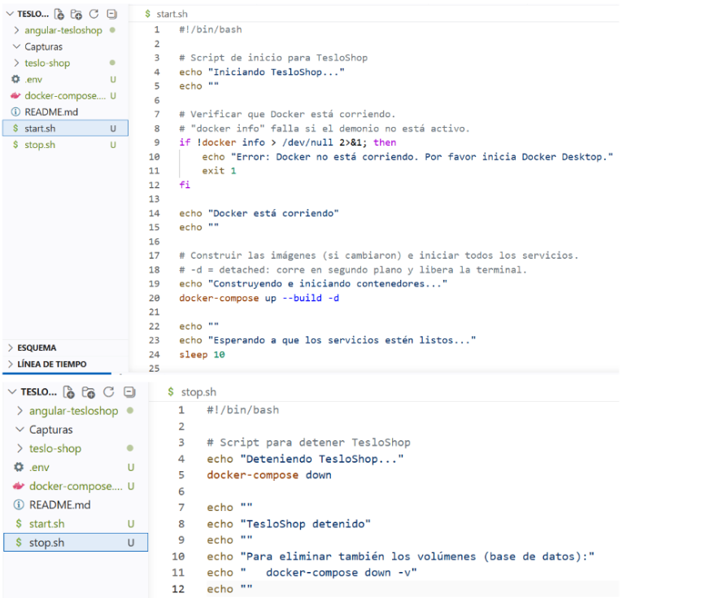

# 8 Ejecutar todo por primera vez

## Comprobar que Docker está instalado y activo
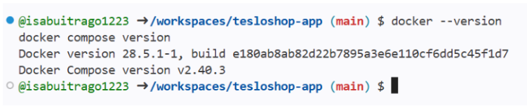

## Dar permisos de ejecución a los scripts

## Lanzar la aplicación
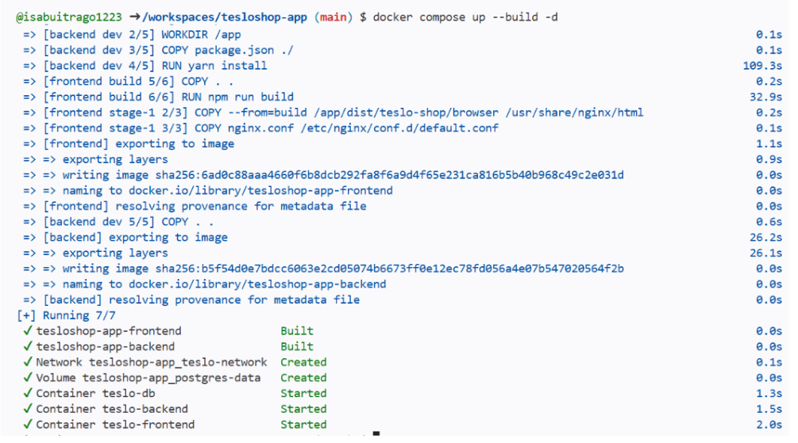

## Verificar que los tres servicios están corriendo

## Probar la aplicación en codespace
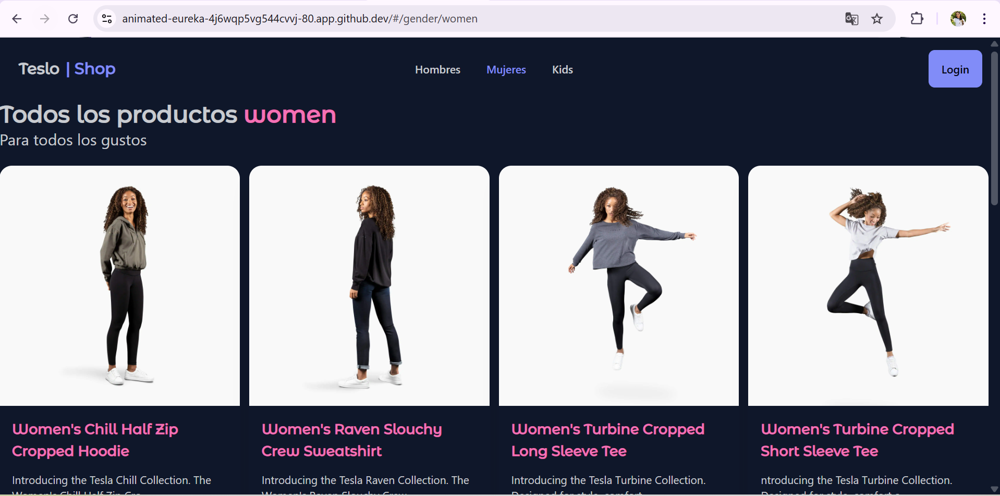
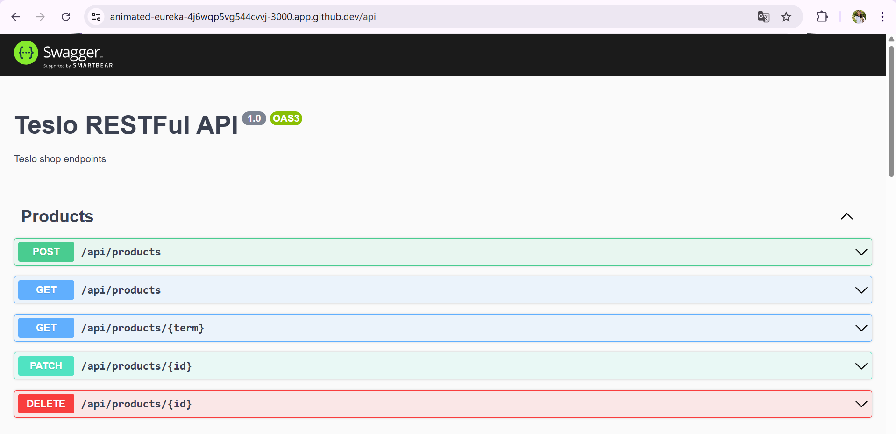

## Poblar la base de datos con el Seed
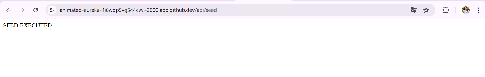

## Puertos
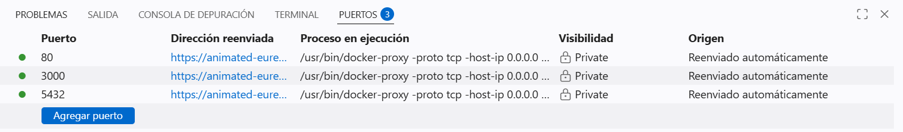
